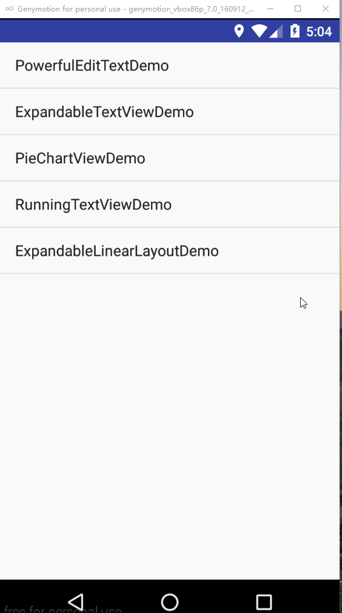

### NumberRunningTextView介绍
&emsp;&emsp;NumberRunningTextView是一个自带数字滚动动画的TextView,通过使用setContent(String str)方法，传入相应的金额数字字符串（如"1354.00"），或者数字的字符串（如200）,当页面初始化完成的时候，就可以看到数字滚动的效果，和支付宝中进入余额宝界面，显示余额滚动的效果类似，具体的效果如下：

### 使用
在布局文件中，使用NumberRunningTextView，代码如下：

演示金额滚动的NumberRunningTextView

     <com.chaychan.viewlib.NumberRunningTextView
                android:id="@+id/tv_money"
                android:layout_width="wrap_content"
                android:layout_height="wrap_cointent"
                android:layout_centerInParent="true"
                android:text="0.00"
                android:textColor="#fff"
                android:textSize="30sp"
                android:textStyle="bold"
                />

演示整数数字滚动的NumberRunningTextView

     <com.chaychan.viewlib.NumberRunningTextView
                android:id="@+id/tv_num"
                android:layout_width="wrap_content"
                android:layout_height="wrap_content"
                android:layout_centerInParent="true"
                android:text="200"
                android:textColor="#fff"
                android:textSize="30sp"
                app:textType="num"
                />

&emsp;&emsp;二者的区别在于textType的设置，textType是用于指定内容的格式，总共有money(金钱格式，带小数)和num（整数格式），默认是金钱的格式，不配置textType的话，默认就是使用金钱格式。

在java文件中根据id找到对应的view后，调用setContent()方法即可。

     tvMoney.setContent("1354.00");
     tvNum.setContent("200");

#### 关闭金额的自动格式化（每三位数字添加一个逗号）
&emsp;&emsp;上图所示，最后显示的金额数字经过了处理，每三位添加一个逗号，这使得数字看起来比较好看，金额默认是使用这种格式，如果不想要这种格式的数字，可以在布局文件中，NumberRunningTextView的配置中，将useCommaFormat设置为false,这样最终的数字就不会是带有逗号了，效果如下：

#### 关闭执行动画的时机
&emsp;&emsp;当一开始进入界面的时候，初始化数据完毕，NumberRunningTextView设置数据完毕，会自动执行数字滚动的动画，如果进行刷新操作，从服务器获取新的数据，重新设置数据，NumberRunningTextView会自动判断传入的内容是否有变化，如果没有变化，则不会再次滚动，这和支付宝的余额宝界面中的金额类似，当在余额宝界面下拉刷新时，金额没有变化，数字不会再次滚动，而当提现后重新回到该界面，金额发生变化后，就会再次滚动，效果如下:

SwipeRefreshLayout的刷新回调中，只做了这样的处理，NumberRunningTextView设置的内容还是原来的数据。

     srlRoot.setOnRefreshListener(new SwipeRefreshLayout.OnRefreshListener() {
            @Override
            public void onRefresh() {
                tvMoney.setContent("1354.00");
                tvNum.setContent("200");
                srlRoot.setRefreshing(false);
            }
        });

&emsp;&emsp;当你进行下拉刷新的时候，内容如果没有发生变化，数字是不会滚动的，如果内容发生变化，数字又会重新进行滚动,这里修改下拉刷新的代码,模拟数据变化的情况，演示一下：
   
	 srlRoot.setOnRefreshListener(new SwipeRefreshLayout.OnRefreshListener() {
            @Override
            public void onRefresh() {
                tvMoney.setContent("1454.00");
                tvNum.setContent("300");
                srlRoot.setRefreshing(false);
            }
        });

效果如下：

&emsp;&emsp;如果想要在刷新的时候，无论内容是否有变化都要执行滚动动画的话，可以在布局文件中，NumberRunningTextView的配置中，将runWhenChange设置为false即可,此时，无论内容是否有变化，都会执行滚动动画，效果如下：

#### 可以修改数字滚动动画执行的时间

如果不设置动画执行的周期，则会使用默认的动画执行周期，如下所示都是使用默认动画执行时间

     		<com.chaychan.viewlib.NumberRunningTextView
                android:id="@+id/tv_money"
                android:layout_width="wrap_content"
                android:layout_height="wrap_content"
                android:layout_centerInParent="true"
                android:text="0.00"
                android:textColor="#fff"
                android:textSize="30sp"
                android:textStyle="bold"
                />

 
			<com.chaychan.viewlib.NumberRunningTextView
                android:id="@+id/tv_num"
                android:layout_width="wrap_content"
                android:layout_height="wrap_content"
                android:layout_centerInParent="true"
                android:text="200"
                android:textColor="#fff"
                android:textSize="30sp"
                app:textType="num"
                />

执行的效果如下:

修改其中一个控件的动画执行时间：

    <com.chaychan.viewlib.NumberRunningTextView
                android:id="@+id/tv_money"
                android:layout_width="wrap_content"
                android:layout_height="wrap_content"
                android:layout_centerInParent="true"
                android:text="0.00"
                android:textColor="#fff"
                android:textSize="30sp"
                android:textStyle="bold"
                />

 
			<com.chaychan.viewlib.NumberRunningTextView
                android:id="@+id/tv_num"
                android:layout_width="wrap_content"
                android:layout_height="wrap_content"
                android:layout_centerInParent="true"
                android:text="200"
                android:textColor="#fff"
                android:textSize="30sp"
                app:textType="num"
				app:duration="3000" 
                />

执行的效果如下：

&emsp;&emsp;在使用的过程中，就可以通过改变动画执行的周期来控制数字滚动的速度了，只需在布局文件中，配置duration属性，注意这里是以毫秒(ms)为单位。

#### 可以修改数字最少要达到的某个值才会滚动

&emsp;&emsp;这个功能弥补之前空间的一个缺陷，就是在数字很小的时候，比如金额的数字为0.01，整型数字为1，那么动画执行的结果让人感觉起来有点卡顿的感觉，如下所示：

&emsp;&emsp;所以需要让数字达到某个值才可以进行滚动，当值未能到达这个值的时候，则不会滚动，当达到指定的值后，就可以进行滚动，对应的属性分别为minMoney(设置最小达到的金额)、minNum(设置最小达到的数字)，使用如下：

     	<com.chaychan.viewlib.NumberRunningTextView
                android:id="@+id/tv_money"
                android:layout_width="wrap_content"
                android:layout_height="wrap_content"
                android:layout_centerInParent="true"
                android:text="0.00"
                android:textColor="#fff"
                android:textSize="30sp"
                android:textStyle="bold"
                app:runWhenChange="false"
                app:minMoney="0.98"
                />

   		 <com.chaychan.viewlib.NumberRunningTextView
                android:id="@+id/tv_num"
                android:layout_width="wrap_content"
                android:layout_height="wrap_content"
                android:layout_centerInParent="true"
                android:text="200"
                android:textColor="#fff"
                android:textSize="30sp"
                app:textType="num"
                app:runWhenChange="false"
                app:minNum="5"
                />

当我传入金额小于九毛八(0.98)的时候，则不会执行滚动的动画,当我传入的数字小于5的时候，数字也不会滚动。如图所示

当数字达到要求的时候，则会滚动，如图所示

&emsp;&emsp;如果不设置这个属性，默认情况下，金额需要达到0.1，数字需要达到3才会进行滚动，具体需要可以根据使用进行配置，如果你不觉得数字过小时动画看起来卡的话，那么可以设置这个属性为0，如果是使用金钱类型，设置最小金额minMoney（浮点类型）,如果是整型数字类型，设置最小的数字minNum(整数类型)。

&emsp;&emsp;关于NumberRunningTextView的源码解析可以查看我的博客 

[http://blog.csdn.net/chay_chan/article/details/70196478](http://blog.csdn.net/chay_chan/article/details/70196478)
和
[http://blog.csdn.net/Chay_Chan/article/details/73381863](http://blog.csdn.net/Chay_Chan/article/details/73381863)