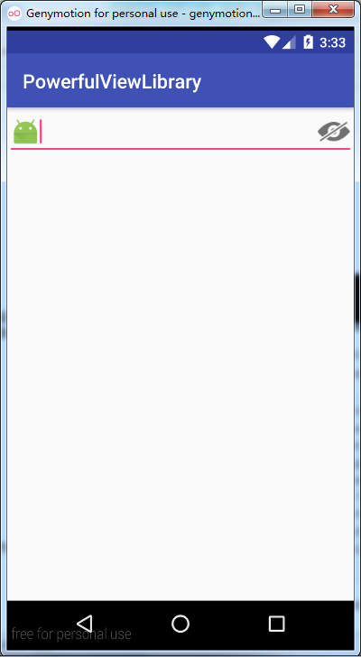

### PowerfulEditText介绍
#### 1.自带清除文本功能 
&emsp;&emsp;PowerfulEditText自带清除文本功能，只需在布局文件该View属性中添加funcType,指定为canClear,就可以自带清除文本功能，使用如下：

    <?xml version="1.0" encoding="utf-8"?>
	<LinearLayout
	    xmlns:android="http://schemas.android.com/apk/res/android"
	    xmlns:app="http://schemas.android.com/apk/res-auto"
	    android:layout_width="match_parent"
	    android:layout_height="match_parent"
	    android:orientation="vertical"
	>

	    <com.chaychan.viewlib.PowerfulEditText
	        android:layout_width="match_parent"
	        android:layout_height="wrap_content"
	        app:funcType="canClear"
	        />

    </LinearLayout>

运行后，效果如下：

&emsp;&emsp;上图所示的删除图标是默认的，当然也可以指定右侧删除按钮的图标，只需添加多drawableRight属性，这里建议使用一个selector，分别为普通状态和按压状态设置一张图片，这样当按压图标的时候，会有一种按压的状态，selector的编写如下：

    <?xml version="1.0" encoding="utf-8"?>
	<selector
	  xmlns:android="http://schemas.android.com/apk/res/android">
	    <item android:state_pressed="true" android:drawable="按压后的图标" />
	    <item android:drawable="普通状态的图标" />
	</selector>

#### 2.自带密码输入框切换明文密文格式的功能

&emsp;&emsp;PowerfulEditText自带密码输入框切换明文密文格式的功能，目前大多数App密码输入栏一般支持密码明文、密文的显示，如果需要用到该功能，可以将funcType中指定为canWatchPwd,就可以轻松使用这种功能，使用如下：

    <com.chaychan.viewlib.PowerfulEditText
        android:layout_width="match_parent"
        android:layout_height="wrap_content"
        app:funcType="canWatchPwd"
        android:inputType="textPassword"
        />

运行后，效果如下：

&emsp;&emsp;上图所示的右侧图标是默认的，同样也可以指定开启查看密码的图标和关闭查看密码的图标，只需要在属性eyeOpen中指定开启查看密码引用的图片，在eyeClosed中指定关闭查看密码引用的图片即可，如下，更换开启查看密码的图标,如项目默认的图标ic_launcher

    <com.chaychan.viewlib.PowerfulEditText
        android:layout_width="match_parent"
        android:layout_height="wrap_content"
        app:funcType="canWatchPwd"
        android:inputType="textPassword"
        app:eyeOpen="@mipmap/ic_launcher"
        />

运行后，效果如下：

	

这样开启查看密码的图标就更换了，如果还需要更换关闭密码查看的图标，可以指定eyeClose，引用对应的图标。

#### 3.设置drawableLeft和drawableRight图片大小的功能
&emsp;&emsp;原生的EditText并不能在属性中指定drawableLeft或drawableRight图片的大小，所以一般开发的过程中，一些程序员会采用简单粗暴的方法，直接引用一张宽高都很小的图片。但是在不同屏幕分辨率下，兼容性就不是很好，比如在一些屏幕分辨率较高的手机上运行，图标会显得模糊。PowerfulEditText可以指定drawableLeft和drawableRight图片的宽高大小，可以指定为多少个dp,这样在开发的时候，可以在各个分辨率图片文件夹中放入不同尺寸的图标，通过设定图片的宽高属性来限制显示的大小，下面演示一下：

    <com.chaychan.viewlib.PowerfulEditText
        android:layout_width="match_parent"
        android:layout_height="wrap_content"
        app:funcType="canWatchPwd"
        android:inputType="textPassword"
        android:drawableLeft="@mipmap/ic_launcher"
        />

&emsp;&emsp;如图，指定了drawableLeft的图片为ic_laucher,图片看起来比较大，这时如果我们想要将其调小，则可以添加leftDrawableWidth、leftDrawableHeight指定左侧图片的宽高。

    <com.chaychan.viewlib.PowerfulEditText
        android:layout_width="match_parent"
        android:layout_height="wrap_content"
        app:funcType="canWatchPwd"
        android:inputType="textPassword"
        android:drawableLeft="@mipmap/ic_launcher"
        app:leftDrawableWidth="30dp"
        app:leftDrawableHeight="30dp"
        />

上面代码，指定了leftDrawableWidth和leftDrawableHeight的大小都为30dp，运行的效果如下：

可以看到左侧的图标变小了，同样也可以设置右侧图片的宽高，对应的属性是rightDrawableWidth、rightDrawableHeight。

 
#### 右侧图标点击事件
PowerfulEditText同样支持右侧图片的点击事件，如果funcType指定为canClear，则默认点击是清除文本。如果需要进行一些额外的操作，则可以设置回调，比如搜索输入框，右侧是一个搜索的按钮，需要为其设置点击事件的回调。

布局文件：

     <com.chaychan.viewlib.PowerfulEditText
        android:id="@+id/pet"
        android:layout_width="match_parent"
        android:layout_height="wrap_content"
        android:drawableRight="@mipmap/search"
        />

Activity
     
      PowerfulEditText petUsername = (PowerfulEditText) findViewById(R.id.pet);
        petUsername.setOnRightClickListener(new PowerfulEditText.OnRightClickListener() {
            @Override
            public void onClick(EditText editText) {
                String content = editText.getText().toString().trim();
                if (！TextUtils.isEmpty(content)){
                    Toast.makeText(MainActivity.this, "执行搜索逻辑", Toast.LENGTH_SHORT).show();
                }
            }
        });

运行效果如下：

    
&emsp;&emsp;上面布局文件中，和普通的EditText属性一样，funcType一共有三个属性，分别是normal(默认)、canClear(带清除功能)、canWatchPwd（带查看密码功能）。如果不指定funcType，则默认是normal,普通方式。

&emsp;&emsp;Activity中，为PowerfulEditText设置右侧图片的点击事件，调用setOnRightClickListener设置点击后的回调，这里点击后如果有文本内容，则执行搜索逻辑。

&emsp;&emsp;关于PowerfulEditText的源码解析可以观看我的博客 [http://blog.csdn.net/chay_chan/article/details/63685905](http://blog.csdn.net/chay_chan/article/details/63685905)